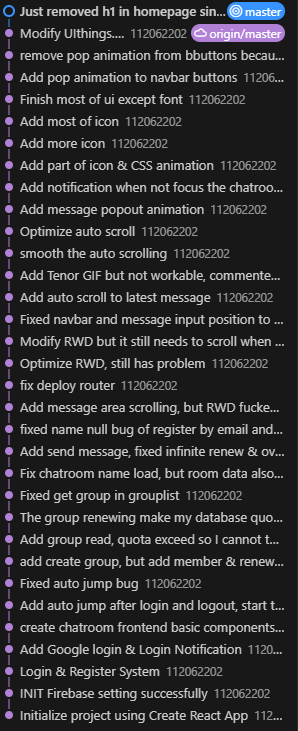

# Whisperoot (Chatroom web app for Software Studio Course midterm project)

* [The Firebase page](https://whisperoot-579d7.web.app/)
* [The Firebase project(Alreagy set cgvlab711839@gmail.com as editor)]()

## Functions required in spec

* Basic
1. Membership Mechanism
    * Email Sign In
        - When you haven't login, there will be a "Login" button in navbar on top of whole website, click it will direct you to the Login Page.
        - If you had registered an account, just enter your email and password as the hint in input box, then press the "Login" button.
        - If you hadn't registered an account, simply click the "Don't have an account? Register now!" text, then it will change the content of login page to a register mode.
    * Email Sign Up
        * After anter the register mode of login page, just enter your email, username, password and comfirm your password as the hint on input boxes, then press the "register" button under them. 

2. Host Firebase Page
    * The link to the firebase page of this project is https://whisperoot-579d7.web.app/

3. Database read and write
    * I used Firestore database instead of realtime database since its structure adapts the function of a chatroom more.
    * The Firestore database is mainly divided into three sets, user-data, group-data and group-list.
        - Set user-data is used to store user's information like email, username, group list, distinguished by the uid generated by Firebase authentication system, users can only access their own user-data document. 
        - Set group-data is used to store message or other content of chatrooms, distinguished by a 8 words uuid, since the chatrooms are private, only member of the chatroom can access.
        - Set group-list is used to store information of chatrooms like name, description and member list, distinguished by a 8 words uuid which is the same with that in group-data set. All authenticated user can access this since it is required to distinguish whether a user is a member of a private chatroom.

4. RWD
    * The website works well when testing on my own 17' notebook, common size smartphone and 10.9' iPad Air, no contents disappear unless you a even unusable small size.

5. Git
    * You can check the commit history at [this github repo](), it is a private repo because I pushed the API key directly to make sure TA can setup my website locally successfully, I alreagy invite cgvlab711839@gmail.com, please join it to check.
    * Or here is a screenshop of my commit history in vscode(since I'm still modifying README.md, it is not really up to date, if you wants the actually latest version, please check it at the github repo above)
    

6. Chatroom
    * After login there will ba a "Chat" button on the navbar, press it will direct you to chatroom page.
    * There is a sidebar in the chatroom page, you can press the "Groups" button in it to expand your group list.
    * If you have some group, then they will be listed in the sidebar as some clickable text which is their name after you expand the group list, click on it to go into that chatroom.
    * There are "Create a new group" and "Join a group" button under the list of groups after expand it, press them can direct you to corresponding page.
    * In create group page, just type in the name and description for your new group as the hint in input boxes, then press the "Create" button, it will redirect you to the new chatroom, after created succefully.
    * If you want to invite other people to your chatroom, click the copy button beside the room code under the name of the chatroom, that will be its code AKA uuid of the group used in database, pass that to who you want to invite then they can join group by that.
    * In join group page, just enter the code of an chatroom which you got from people who invite you, then press the "Join" button, it will redirect you to the chatroom after joined succefully.
    * When you are in a chatroom, there will be a input box for you to type message at the buttom of the website.
    * You can click the send butoon which is a paper plane icon beside the message input or just press ENTER on your keyboard to send the message.
    * A message with only whitespace in it will be blocked automatically.
    * The hint in message input will randomly change each time, just for fun.

* Advance
1. Sign In/Up with Google
    * There's a button with google icon under the Login button for email and password, just click it and login your gmail   account at the pop up window.

2. Chrome Notification
    * When you login or join group, it will say welcome to you by notification.
    * When you minimized the chatroom page or switch to other tab from the chatroom, it will notifice you when there's a new message in the chatroom you opened.

3. CSS Animation
    * There is a "float" animation on a button when you hover it.(not just hover, it has transition by keyframe)
    * There is a "pop" animation on items in group list in sidebar when you expand it.
    * A new message will "pop out" by a CSS animation which change the size of its container.

4. Deal with HTML Insertion
    * By put the message content in a <p></p> area, it will be treated as a text instead of an innerHTML item.
    It didn't have any problem during my test.

## How to  setup locally

1. Clone the repository:
    ```bash
    git clone https://github.com/yourusername/whisperoot.git
    ```
2. Navigate to the project directory:
    ```bash
    cd whisperoot
    ```
3. Install dependencies:
    ```bash
    npm install
    ```
4. Start local dev server
    ```bash
    npm start
    ```
5. Open the local website with your browser, and use the website just by the same way to a remote one